# 🎯 Instructor Guide: AI Native Development Lab

> **This is the FACILITATOR reference.** Participants use [README.md](README.md).

## Executive Summary

This hands-on lab guides participants from simple instruction files to fully orchestrated agent workflows using VS Code Copilot's native customization primitives. The lab follows a **dual-track approach** where participants choose between documentation generation or test generation workflows, then scales to enterprise patterns with Skills and APM.

| Field | Value |
|-------|-------|
| **Session** | AI Native Development Lab: Scaling GitHub Copilot in the Enterprise |
| **Duration** | 90 minutes |
| **Format** | ~40% demo/explanation, ~60% hands-on |
| **Speakers** | Facilitator 1 Meppiel (lead) + Facilitator 2 Romp (co-facilitator) |
| **Audience** | 80 Microsoft Solution Engineers |
| **Room Setup** | Theater-style with laptops, main screen + code screen if available |

---

## 🚨 INSTRUCTOR QUICK START (Read This First)

### The Night Before

- [ ] Clone repo fresh and verify all golden examples work
- [ ] Test APM CLI: `apm --version` and `apm compile --verbose`
- [ ] Pre-create a GitHub Issue in a test repo for Coding Agent demo
- [ ] Verify you have GitHub MCP Server configured (for Act 3 demo)
- [ ] Load slides for Pioneer/Consumer model section
- [ ] Print 5 copies of [cheatsheet.md](cheatsheet.md) for struggling participants

### 30 Minutes Before

- [ ] Project README.md on main screen
- [ ] Have VS Code open with `sample-projects/contoso-orders-python/`
- [ ] Verify Copilot Chat responds (type "hello" to test)
- [ ] Open golden-examples in a separate VS Code window (for demos)
- [ ] Mute Slack/Teams notifications

### Your Job Today

1. **Keep energy high** — This is hands-on, not a lecture
2. **Watch the room** — If >30% look lost, pause and help
3. **Time-box ruthlessly** — It's OK to not finish; understanding beats completion
4. **Celebrate wins** — When someone's handoff button appears, acknowledge it!

---

## 🎭 Instructor Roles & Handoffs

| Time | Lead | Supporting | Handoff Cue |
|------|------|------------|-------------|
| 0:00-0:05 | Facilitator 2 | Facilitator 1 roams | Facilitator 2: "Facilitator 1, want to show us the problem?" |
| 0:05-0:10 | Facilitator 1 | Facilitator 2 prepares Ex1 | Facilitator 1: "Facilitator 2 will walk you through your first primitive" |
| 0:10-0:25 | Facilitator 2 | Facilitator 1 roams/helps | Facilitator 2: "How's everyone doing? Facilitator 1, any questions from the room?" |
| 0:25-0:40 | Facilitator 2 | Facilitator 1 prepares Ex3 | Facilitator 2: "Now let's make these prompts reusable" |
| 0:40-1:00 | Facilitator 1 | Facilitator 2 roams/helps | Facilitator 1: "This is where it gets powerful" |
| 1:00-1:20 | Facilitator 1 (demos) | Facilitator 2 handles APM hands-on | Facilitator 1: "Facilitator 2, want to walk them through installing a skill?" |
| 1:20-1:30 | Both | — | Wrap-up, both answer questions |

**Communication:** Use subtle hand signals (✋ = need 2 min, 👍 = good to transition)

```
┌──────────────────────────────────────────────────────────────────────────────────────────┐
│                                                                                          │
│                    🚀 AI NATIVE DEVELOPMENT LAB                                          │
│                         Scaling GitHub Copilot in the Enterprise                         │
│                                                                                          │
├──────────────────────────────────────────────────────────────────────────────────────────┤
│                                                                                          │
│    THE PROSE FRAMEWORK                     YOUR JOURNEY TODAY                            │
│    ──────────────────                      ───────────────────                           │
│                                                                                          │
│    📋 .instructions.md                     ┌─────────────────────────────────────────┐   │
│       "Engineering Context"                │  Act 1:  FOUNDATION        (25 min)     │   │
│       Auto-apply team rules                │  Act 2:  SDLC WORKFLOWS    (35 min)     │   │
│                                            │  Act 3:  ENTERPRISE SCALE  (20 min)     │   │
│    📝 .prompt.md                           │  Act 4:  TAKEAWAYS         (10 min)     │   │
│       "Prompts"                            └─────────────────────────────────────────┘   │
│       Reusable /commands                                                                 │
│                                            CHOOSE YOUR TRACK:                            │
│    🤖 .agent.md                            ─────────────────────                         │
│       "Orchestration"                      📖 Documentation  OR  🧪 Testing              │
│       AI personas + handoffs                                                             │
│                                                                                          │
│    ⚡ SKILL.md                             THEN SCALE:                                    │
│       "Skills"                             ─────────────                                 │
│       Agent-discovered bundles             🏗️ APM install                                │
│                                                                                          │
├──────────────────────────────────────────────────────────────────────────────────────────┤
│                                                                                          │
│    🔗 github.com/DevExpGbb/ai-native-dev-lab                                             │
│                                                                                          │
│    📚 Facilitator 1meppiel.github.io/awesome-ai-native/docs/concepts (PROSE Framework)   │
│                                                                                          │
└──────────────────────────────────────────────────────────────────────────────────────────┘
```
---

## 🕐 Minute-by-Minute Timeline

Use this as your real-time guide during the session:

| Time | Min | Who | What | Visual |
|------|-----|-----|------|--------|
| 0:00 | 0 | Facilitator 2 | Welcome, setup check | README.md on screen |
| 0:03 | 3 | Facilitator 2 | "Raise hands who has Chat working?" | — |
| 0:05 | 5 | Facilitator 1 | Demo: Brownfield problem | `order_service.py` |
| 0:10 | 10 | Facilitator 2 | Demo: Create instruction file | `.github/instructions/` |
| 0:13 | 13 | Facilitator 2 | "Your turn — Exercise 1" | README.md Ex1 section |
| 0:19 | 19 | Facilitator 2 | "Check: anyone stuck?" | Walk room |
| 0:25 | 25 | Facilitator 2 | Demo: Create prompt file | `.github/prompts/` |
| 0:28 | 28 | Facilitator 2 | "Your turn — Exercise 2" | README.md Ex2 section |
| 0:38 | 38 | Facilitator 2 | "Quick check: `/command` works?" | — |
| 0:40 | 40 | Facilitator 1 | Demo: Agent handoffs | Golden example agents |
| 0:45 | 45 | Facilitator 1 | "Your turn — Exercise 3" | README.md Ex3 section |
| 0:55 | 55 | Facilitator 1 | "Check: handoff button visible?" | Walk room |
| 1:00 | 60 | Facilitator 2 | Demo: Skills structure | `skills-demo/` |
| 1:05 | 65 | Facilitator 1 | Demo: GitHub Coding Agent | GitHub UI or screenshots |
| 1:07 | 67 | Facilitator 1 | Demo: APM compile | Terminal |
| 1:10 | 70 | Facilitator 1 | "Your turn — APM hands-on" | Terminal |
| 1:17 | 77 | Facilitator 1 | Slides: Pioneer/Consumer model | Slides |
| 1:20 | 80 | Facilitator 2 | Recap + resources | Slide with links |
| 1:25 | 85 | Both | Q&A | — |
| 1:30 | 90 | Both | "Thank you, find us for questions" | — |

---

## 🏗️ Lab Timeline (90 minutes)


---

## 📚 The Primitives Stack

```mermaid
graph TB
    subgraph "VS Code Copilot Customization Hierarchy"
        I[".instructions.md<br/>📋 Rules & Guidelines"]
        P[".prompt.md<br/>📝 Reusable Tasks"]
        A[".agent.md<br/>🤖 AI Personas + Handoffs"]
        S["SKILL.md<br/>⚡ Composed Capabilities"]
    end
    
    I -->|"Referenced by"| P
    P -->|"Can specify"| A
    A -->|"Can chain to"| A
    A -.->|"Evolves into"| S
    
    style I fill:#e1f5fe,stroke:#01579b
    style P fill:#fff3e0,stroke:#e65100
    style A fill:#f3e5f5,stroke:#7b1fa2
    style S fill:#e8f5e9,stroke:#2e7d32
```



| Primitive | Purpose | Trigger | Complexity |
|-----------|---------|---------|------------|
| `.instructions.md` | Define rules/guidelines | Auto-applied or manual | ⭐ Simple |
| `.prompt.md` | Reusable task workflows | `/command` in chat | ⭐⭐ Moderate |
| `.agent.md` | AI personas with handoffs | Agent dropdown | ⭐⭐⭐ Advanced |
| `SKILL.md` | Composed capabilities bundle | Agent discovers automatically | ⭐⭐⭐⭐ Expert |

**Key Agent Tools:**

| Tool | Purpose |
|------|---------|
| `search`, `usages` | Read-only analysis |
| `createFile`, `editFile` | File creation/modification |
| `runSubagent` | Spawn parallel workers for independent tasks |
| `issue_write` (MCP) | Create GitHub Issues |
| `assign_copilot_to_issue` (MCP) | Assign GitHub Coding Agent to issue |

---

## 🎓 Two Tracks

Participants choose one track based on their interest:

```mermaid
graph LR
    subgraph "Choose Your Track"
        DOC["📖 Documentation Track<br/>Auto-generate docs"]
        TEST["🧪 Testing Track<br/>Auto-generate tests"]
    end
    
    START((Start)) --> DOC
    START --> TEST
    
    DOC --> SAME["Same Core Concepts<br/>Different Content"]
    TEST --> SAME
    
    style DOC fill:#c8e6c9,stroke:#2e7d32
    style TEST fill:#bbdefb,stroke:#1565c0
```



| Track | Focus | Deliverable |
|-------|-------|-------------|
| **📖 Documentation** | Auto-generate documentation | Instructions → Doc Prompt → Analyzer + Writer Agents |
| **🧪 Testing** | Auto-generate unit tests | Instructions → Test Prompt → Analyzer + Tester Agents |

---

## 📖 Session Flow Details

### ⏰ Timing Guidance

| Section | Duration | "On Track" Signal | "Behind" Recovery |
|---------|----------|-------------------|-------------------|
| Setup | 5 min | 80% have Chat open | Skip track choice, assign by seating |
| Exercise 1 | 15 min | Most create 1 file by min 8 | Show golden example, have them copy |
| Exercise 2 | 15 min | `/command` appears by min 10 | Pair struggling participants |
| Exercise 3 | 20 min | Handoff button visible by min 15 | Skip second agent, demo instead |
| Scaling | 20 min | — (demo-heavy, you control pace) | Cut Pioneer/Consumer to 1 slide |
| Wrap-up | 10 min | Questions flowing | Prompt with "What surprised you?" |

**⚠️ Golden Rule:** If you're behind, prioritize *understanding one primitive well* over rushing through all of them.

---

### Act One: Foundation — From Vibe Coding to AI Native Development (25 min)

#### Introduction & Setup Check (5 min) — Facilitator 2 + Facilitator 1

**Opening Script (Facilitator 2):**

> "Welcome! In the next 90 minutes, you'll go from simple Copilot prompts to building multi-agent workflows that generate documentation or tests following YOUR team's standards. By the end, you'll have 5 files you can take back to your customers tomorrow."

**Objectives:**

- Verify VS Code settings are enabled
- Orient participants to the primitives stack
- Choose a track (documentation or testing)

**Setup Checklist (project on screen, have participants raise hands):**

- [ ] "Raise your hand if VS Code is open" (should be 100%)
- [ ] "Raise your hand if Copilot Chat is working — try typing 'hello'" (expect 90%+)
- [ ] "Raise your hand if you have the repo cloned" (expect 80%+)

**⚠️ Common Issues:**

| Problem | Solution | Time Cost |
|---------|----------|-----------|
| Copilot not responding | Check sign-in, reload window | 30s |
| Settings not taking effect | `Cmd+Shift+P` → "Reload Window" | 10s |
| Repo not cloned | Use Codespaces link in README | 2 min |
| Chat opens but no response | Check Copilot subscription status | 1 min |

**If >10% have issues:** "If you're having setup issues, raise your hand and Facilitator 1 will help you. Everyone else, let's dive in."

---

#### Why This Matters: The Brownfield Challenge (5 min) — Facilitator 1

**🎬 EXACT DEMO SCRIPT:**

1. **Open** `sample-projects/contoso-orders-python/src/services/order_service.py`
2. **Say:** "Watch what happens when I ask Copilot a simple question without any context."
3. **Type in Chat:** "Add error handling to the create_order method"
4. **Wait for response, then point out:**
   - "See how it used a generic exception pattern?"
   - "Did it know about our LegacyAuthProvider constraint?"
   - "Did it follow our structlog logging standard?"
5. **Say:** "This is fine for greenfield. But in enterprise brownfield, 'technically correct' isn't enough."

**Key Talking Point:**

> "This is the 'Vibe Coding cliff' — prompting works until your codebase has constraints, patterns, and tribal knowledge. That's what we'll fix today."

**Transition to Facilitator 2:**

> "Facilitator 2 will now show you the first primitive that solves this: instruction files."

---

#### Exercise 1: Modular Instructions (15 min) — Facilitator 2

**🎬 DEMO FIRST (3 min):**

1. Show the empty `.github/instructions/` folder
2. Create `documentation-standards.instructions.md`
3. Add frontmatter: `applyTo: "**/*.py"`
4. Add 2-3 rules (docstring format, required sections)
5. Reopen a Python file and show the instruction is now auto-applied

**Then release participants (12 min hands-on)**

**Say:**

> "Your turn! In README.md, find Exercise 1 for your track. You have 12 minutes. Create at least ONE instruction file. If you finish early, try a second one for a different file type."

**Room Management:**

- **Walk the room** — spot participants staring at blank files
- **At 6 min:** "Everyone should have at least started their first file. Raise your hand if you're stuck."
- **At 10 min:** "Two minutes left. If your instruction file exists, try asking Copilot a question to see if it applies."
- **At 12 min:** Show golden example briefly, acknowledge wins

**⚠️ Common Issues:**

| Problem | Solution |
|---------|----------|
| "Copilot isn't using my instruction" | Check `applyTo` glob, reload window |
| "I don't know what to write" | Point to existing patterns in sample code |
| "File not showing in Chat" | Ensure file is saved, in `.github/instructions/` |

**Deliverable Check:** Ask 2-3 participants to share what standards they captured.


**Deliverable:** 2 working instruction files that automatically apply when editing matching files.

---

### Act Two: Building SDLC Agentic Workflows (35 min)

#### Exercise 2: Reusable Prompts (15 min) — Facilitator 2

**Transition Script:**

> "You've got instructions that auto-apply. But what if you want to trigger a specific workflow on demand? That's what prompt files are for — think of them as saved macros you invoke with a slash command."

**🎬 DEMO FIRST (3 min):**

1. Create `.github/prompts/generate-docs.prompt.md` (or generate-tests for testing track)
2. Show the frontmatter: `name`, `description`, `tools`
3. Show how to reference instruction file with `[text](path)` syntax
4. Type `/generate-docs` in Chat to show it appears
5. Invoke it on a file

**Then release participants (12 min hands-on)**

**Say:**

> "Create your own prompt file. Reference the instruction file you just made. Make sure you can invoke it with `/your-command-name`."

**Room Management:**

- **At 5 min:** "Check: can you see your command when you type `/` in Chat?"
- **At 10 min:** "Try actually running it on a file. Does it follow your standards?"
- **At 12 min:** Quick show of hands — "Who got their command to work?"

**⚠️ Common Issues:**

| Problem | Solution |
|---------|----------|
| Command doesn't appear | Check file is in `.github/prompts/`, has `.prompt.md` extension |
| Wrong tools available | Verify `tools:` array in frontmatter matches what you need |
| Instruction not referenced | Use `[display text](relative/path)` syntax |

**Objectives:**

- Create a `.prompt.md` file with proper frontmatter
- Reference the instruction file
- Use variables (`${file}`, `${selection}`) and specify tools
- Invoke via `/command`


**Deliverable:** A reusable prompt invocable via `/command` in Copilot Chat.

---

#### Exercise 3: SDLC Agents with Handoffs (20 min) — Facilitator 1

**Transition Script (from Facilitator 2):**

> "You've got reusable commands. Facilitator 1 is now going to show you the most powerful primitive — agents that can hand off to each other."

**Energy Injection (Facilitator 1):**

> "This is where it gets interesting. We're going to build a TWO-AGENT pipeline. One agent analyzes, then literally hands off to another agent that creates files. Watch."

**🎬 DEMO FIRST (5 min):**

1. **Show the Analyzer agent** (`doc-analyzer.agent.md` or `test-analyzer.agent.md`)
   - Point out: limited tools (read-only)
   - Point out: `handoffs` array in frontmatter
2. **Show the Generator agent** (`doc-writer.agent.md` or `test-generator.agent.md`)
   - Point out: editing tools enabled
   - Point out: references instruction file
3. **Live demo the handoff:**
   - Select Analyzer from @ menu
   - Ask it to analyze `order_service.py`
   - Wait for analysis to complete
   - **Click the handoff button** (pause for effect!)
   - Show Generator receiving context and creating files

**Say:**

> "See that button? That's an agent-to-agent handoff. The Analyzer did its job — now the Generator takes over with full context."

**Then release participants (15 min hands-on)**

**Say:**

> "Create BOTH agents. Start with the Analyzer — give it read-only tools. Then create the Generator. The magic is the `handoffs` frontmatter that creates that button."

**Room Management:**

- **At 5 min:** "Everyone should have at least started their Analyzer agent"
- **At 10 min:** "Start your Generator agent if you haven't. Check: does your Analyzer have the handoff button?"
- **At 15 min:** "If your handoff works, try the Challenge options in README — add a third agent or use runSubagent"

**⚠️ Common Issues:**

| Problem | Solution |
|---------|----------|
| Handoff button doesn't appear | Check `handoffs` array syntax, agent name must match file |
| Agent not in dropdown | Reload window, ensure file is `.agent.md` in `.github/agents/` |
| Generator doesn't receive context | Confirm `send: false` in handoff (or true to include message) |

**Success Signal:** When participants start clicking handoff buttons and things happen — that's the "aha!" moment. Celebrate it.

**Objectives:**

- Create two `.agent.md` files (Analyzer → Generator pattern)
- Define specialized AI personas with constrained tools
- Implement handoff between agents
- (Challenge) Use `runSubagent` for parallel task decomposition
- (Demo only) Show GitHub Coding Agent via MCP Server for async cloud work

```mermaid
stateDiagram-v2
    [*] --> Analyzer: User selects agent
    
    state "🔍 Analyzer Agent" as Analyzer {
        [*] --> Analyze
        Analyze: Read-only tools
        Analyze: Understands code structure
        Analyze --> [*]: Analysis complete
    }
    
    Analyzer --> Handoff: Click "Generate" button
    
    state "📝 Generator Agent" as Generator {
        [*] --> Generate
        Generate: Edit tools enabled
        Generate: Creates files
        Generate: Can spawn runSubagent workers
        Generate --> [*]: Files created
    }
    
    Handoff --> Generator
    Generator --> [*]: Workflow complete
```



**Deliverable:** Two agents with a working handoff button.

**Challenge Options (for fast finishers):**

- **Option A:** Add a third agent (Reviewer) with handoff back for revisions
- **Option B:** Use `runSubagent` to spawn parallel workers for independent tasks

**Demo Note (GitHub Coding Agent):** Show how the same pattern scales to cloud with GitHub MCP Server — `issue_write` creates issues, `assign_copilot_to_issue` spawns async Coding Agents.

---

### Act Three: Scaling Across the Enterprise (20 min)

**Transition Script (Facilitator 1):**

> "You've built a working agent pipeline. Now the question is: how do you share this with 10,000 developers? That's what Act 3 is about — packaging and distribution."

**Format Shift:** This section is demo-heavy. Participants mostly watch, with one hands-on APM exercise.

---

#### Agent Skills: Composable Capabilities (5 min) — Facilitator 2 (Demo Only)

**🎬 EXACT DEMO SCRIPT:**

1. **Open** `golden-examples/skills-demo/unit-testing-skill/`
2. **Walk through the structure:**
   - "SKILL.md — this is how the agent discovers it"
   - "instructions/ — same files you just created"  
   - "prompts/ — same prompts you just created"
   - "references/ — extra context documents"
3. **Say:** "The key difference from what you built: you DON'T invoke a skill. The agent DISCOVERS it based on what you're trying to do."
4. **Show SKILL.md frontmatter** — point out the description that triggers discovery

**Key Talking Point:**

> "Think of skills as 'smart packages'. You built the pieces — instructions, prompts, agents. A skill bundles them so the agent finds them automatically."

**Objectives:**

- Show a complete Skill structure (SKILL.md + scripts + references)
- Explain the key difference: agent DISCOVERS based on intent, not explicit invocation
- Demonstrate autonomous skill activation

**Demo Content:**

```
unit-testing-skill/
├── SKILL.md                    # Frontmatter + instructions
├── instructions/
│   └── testing-patterns.instructions.md
├── prompts/
│   └── generate-tests.prompt.md
└── references/
    └── TEST-FIXTURES.md
```

**Key Message:** *"This bundles everything you just learned—procedural knowledge, reusable logic, deterministic scripts. But the key difference: the agent DISCOVERS this based on your intent, you don't invoke it explicitly."*

---

#### GitHub Coding Agent Demo (2 min) — Facilitator 1 (Demo Only)

**🎬 EXACT DEMO SCRIPT:**

1. **Say:** "What if your local agent could spawn cloud workers?"
2. **Show pre-created GitHub Issue** in your test repo
3. **Show the MCP tools** in agent frontmatter: `issue_write`, `assign_copilot_to_issue`
4. **Demonstrate** (or show screenshot of): Copilot creating a PR from an issue
5. **Say:** "Same orchestration pattern — decompose task, create issues, assign to Coding Agents. They work async while you sleep."

**Objectives:**

- Show how local orchestration scales to cloud with GitHub Coding Agent
- Demo the GitHub MCP Server integration

**Demo Flow:**

1. Show `issue_write` tool creating a GitHub Issue
2. Show `assign_copilot_to_issue` assigning Copilot Coding Agent
3. Show the async PR creation in the GitHub UI

**Key Message:** *"Same orchestration pattern — your local agents can now delegate to cloud-scale workers via GitHub's Coding Agent."*

**⚠️ Fallback:** If MCP isn't working, show screenshots. The concept matters more than the live demo.

---

#### Distribution at Scale with APM (12 min) — Facilitator 1 (Demo + Hands-On)

**🎬 DEMO (5 min):**

1. **Show current project structure** — scattered instruction files
2. **Run:** `apm compile --verbose`
3. **Show result:** `AGENTS.md` files now exist in each subdirectory
4. **Explain:** "The agent in `/src/api/` sees API rules. The agent in `/src/data/` sees data rules. Right context, right place."
5. **Run:** `apm install Facilitator 1meppiel/compliance-rules`
6. **Show:** Skill installed in `.github/skills/`

**Then release for hands-on (7 min)**

**Say:**

> "Your turn. Run `apm compile --verbose` in your project. Then try installing a skill from the registry."

**⚠️ Common Issues:**

| Problem | Solution |
|---------|----------|
| `apm: command not found` | Run install script from README |
| Compile produces no output | Need at least one instruction file |
| Install fails | Check network, try different skill name |

**Objectives:**

- Demo (5 min): Show `apm compile` → nested AGENTS.md
- Demo: Show `apm install <skill>` for enterprise distribution
- Hands-on (7 min): Participants run APM install + compile

**Demo:**

```bash
# Show modular instructions becoming nested context
apm compile --verbose

# Install a skill from registry
apm install Facilitator 1meppiel/compliance-rules
```

**Key Message:** *"The agent working in /src/api/ sees API rules. Not database rules. Not test rules. Right context, right place."*

---

#### Pioneer + Consumer Model (3 min) — Facilitator 1 (Slides)

**This is a SLIDE moment.** Switch from code to presentation.

**The 3 Roles (one slide):**

| Role | % of Org | What They Do |
|------|----------|--------------|
| **Pioneers** | 5% | Create primitives, skills, patterns |
| **Validators** | 20% | Test and refine in real workflows |
| **Consumers** | 75% | Use curated skills — get benefits without authoring |

**Say:**

> "Not everyone needs to author skills. 5% of your developers create the patterns. 20% validate them. 75% just benefit. That's how you scale from '10x for some' to '10x for everyone'."

**Key Message:** *"Pioneers capture patterns once, everyone benefits forever. This is how you scale Copilot from 10x for some to 10x for everyone."*

---

### Act Four: Key Event Takeaways (10 min) — Facilitator 2 + Facilitator 1

**Transition Script (Facilitator 1 to Facilitator 2):**

> "Facilitator 2, want to bring us home?"

**Closing Script (Facilitator 2):**

> "Let's recap what you built today. Raise your hand if you have..."
>
> - "...at least one instruction file" (should be ~100%)
> - "...a working prompt command" (should be ~90%)
> - "...two agents with a handoff button" (should be ~70%)
> - "...APM compiled output" (should be ~80%)

**Key Recap (show slide or write on whiteboard):**

```
Instructions (E) → Prompts (P) → Agents (O) → Skills (S) = Reliability (R)
```

**Objectives:**

- Recap the stack: Instructions (rules) → Prompts (tasks) → Agents (personas) → Skills (composed capabilities)
- Share resources: awesome-ai-native guide, APM CLI, agentskills.io
- Q&A

**Resources to Share:**

- [Awesome AI-Native Guide](<https://Facilitator> 1meppiel.github.io/awesome-ai-native/) — bookmark this!
- [PROSE Framework](<https://Facilitator> 1meppiel.github.io/awesome-ai-native/docs/concepts/) — the theory behind today
- [VS Code Customization Docs](https://code.visualstudio.com/docs/copilot/customization/overview) — official reference

**Q&A Guidance:**

- If no questions: "What's one thing you'll try with a customer next week?"
- If too many questions: "Great questions — find us afterward or in Teams"

**Deliverables Checklist:**

| Deliverable | Validation |
|-------------|------------|
| ✅ 2 Custom Instruction files | Applied automatically when editing matching files |
| ✅ 1 Prompt file | Invocable via `/command` in Copilot Chat |
| ✅ 2 Agent files with handoff | Visible handoff button after first agent completes |
| ✅ APM compiled project | Nested AGENTS.md files in folder tree |

---

## 🔄 Workflow Diagrams by Track

### 📖 Documentation Track

```mermaid
flowchart TB
    subgraph Instructions["📋 Instructions Layer"]
        DI[documentation-standards.instructions.md<br/>applyTo: **/*.md]
    end
    
    subgraph Prompt["📝 Prompt Layer"]
        DP[generate-docs.prompt.md<br/>Invoked with /generate-docs]
    end
    
    subgraph Agents["🤖 Agent Layer"]
        DA[doc-analyzer.agent.md<br/>Tools: search, usages]
        DW[doc-writer.agent.md<br/>Tools: createFile, editFile]
    end
    
    DI -.->|"Referenced by"| DP
    DP -->|"Uses agent"| DA
    DA -->|"Handoff: Write Documentation"| DW
    
    style DI fill:#e3f2fd,stroke:#1565c0
    style DP fill:#fff8e1,stroke:#f9a825
    style DA fill:#fce4ec,stroke:#c2185b
    style DW fill:#e8f5e9,stroke:#2e7d32
```



### 🧪 Testing Track

```mermaid
flowchart TB
    subgraph Instructions["📋 Instructions Layer"]
        TI[testing-standards.instructions.md<br/>applyTo: **/*.test.*]
    end
    
    subgraph Prompt["📝 Prompt Layer"]
        TP[generate-tests.prompt.md<br/>Invoked with /generate-tests]
    end
    
    subgraph Agents["🤖 Agent Layer"]
        TA[test-analyzer.agent.md<br/>Tools: search, usages]
        TG[test-generator.agent.md<br/>Tools: createFile, editFile]
    end
    
    TI -.->|"Referenced by"| TP
    TP -->|"Uses agent"| TA
    TA -->|"Handoff: Generate Tests"| TG
    
    style TI fill:#e3f2fd,stroke:#1565c0
    style TP fill:#fff8e1,stroke:#f9a825
    style TA fill:#fce4ec,stroke:#c2185b
    style TG fill:#e8f5e9,stroke:#2e7d32
```



---

## 📁 Repository Structure

```
ai-native-dev-lab/
├── README.md                          # Step-by-step lab guide (PARTICIPANT entry point)
├── lab-structure.md                   # This file (FACILITATOR reference)
├── cheatsheet.md                      # Quick reference (print 5 copies for struggling participants)
├── .vscode/
│   └── settings.json                  # Pre-configured settings (participants should copy this)
│
├── sample-projects/                   # Brownfield sample codebases
│   ├── README.md                      # Language picker guide
│   └── contoso-orders-python/         # FastAPI order management API (~2500 LOC)
│       ├── src/
│       │   ├── api/                   # FastAPI endpoints
│       │   ├── services/              # Business logic
│       │   ├── repositories/          # Data access
│       │   ├── models/                # Domain models
│       │   └── legacy/                # ⚠️ DO NOT MODIFY (brownfield constraint)
│       └── tests/                     # Existing tests (intentional gaps)
│
├── golden-examples/                   # Reference implementations
│   ├── documentation-track/
│   │   ├── .github/
│   │   │   ├── instructions/
│   │   │   ├── prompts/
│   │   │   └── agents/
│   │   └── sample-code/
│   │
│   ├── testing-track/
│   │   ├── .github/
│   │   │   ├── instructions/
│   │   │   ├── prompts/
│   │   │   └── agents/
│   │   └── sample-code/
│   │
│   └── skills-demo/                   # Act 3 reference (demo only)
│       └── unit-testing-skill/
│           ├── SKILL.md
│           ├── instructions/
│           ├── prompts/
│           └── references/
│
├── starter-templates/                 # Scaffolds for participants
│   ├── instructions-template.instructions.md
│   ├── prompt-template.prompt.md
│   └── agent-template.agent.md
│
└── .github/                           # Where participants create their files
    ├── instructions/
    ├── prompts/
    └── agents/
```

---

## ✅ Success Criteria (What Good Looks Like)

### For Participants

By the end of the lab, each participant should have:

| Deliverable | Act | Validation | % Expected |
|-------------|-----|------------|------------|
| 2 Custom Instruction files | Act 1 | Applied automatically when editing matching files | 95% |
| 1 Prompt file | Act 2 | Invocable via `/command` in Copilot Chat | 90% |
| 2 Agent files with handoff | Act 2 | Visible handoff button after first agent completes | 75% |
| Working workflow | Act 2 | Successfully generates docs OR tests for brownfield code | 70% |
| APM-compiled project | Act 3 | Nested AGENTS.md files in folder tree | 80% |
| Installed skill | Act 3 | Skill available for agent discovery | 60% |

### For Instructors

| Metric | Target | Measurement |
|--------|--------|-------------|
| **Completion rate** | >70% reach handoff | Show of hands at end |
| **Engagement** | Minimal phone checking | Visual observation |
| **Energy** | Questions keep coming | Active Q&A period |
| **Follow-up intent** | "I'll try this with a customer" | Ask directly |

---

## 🎯 Key Pedagogical Decisions (Why We Designed It This Way)

| Decision | Rationale | What to Tell Skeptics |
|----------|-----------|----------------------|
| **Progressive Disclosure** | Instructions → Prompts → Agents → Skills builds on each concept | "Each step unlocks the next — you can't do handoffs without understanding agents" |
| **Analyzer → Generator Pattern** | Separates concerns — read-only analysis, then editing | "Real SDLC workflows have phases — design before code" |
| **Brownfield Over Greenfield** | Enterprise reality is messy constraints, not clean slates | "Greenfield is easy mode — we're preparing for real customer scenarios" |
| **Skills as Demo-Only** | Too advanced for 90 min; participants see the evolution | "You'll learn to create skills, but mastering agents comes first" |
| **APM for Distribution** | Shows how pioneers share context with consumers | "This is how you get from 'works for me' to 'works for everyone'" |
| **Dual-Track Choice** | Lets participants apply to their interest area | "Same patterns, different domains — pick what matters to your customers" |
| **Discovery-First Exercises** | Participants see the problem before the solution | "We show you why it's broken, THEN how to fix it" |

---

## 🔗 PROSE Framework Alignment

The lab brings the [PROSE Framework](<https://Facilitator> 1meppiel.github.io/awesome-ai-native/docs/concepts/) to life:

| PROSE Element | Lab Section | What Participants Experience |
|---------------|-------------|------------------------------|
| **E**ngineering (Context) | Exercise 1 | Instructions with `applyTo` provide scoped context |
| **P**rompts | Exercise 2 | Create `.prompt.md` with variables, invoke via `/command` |
| **O**rchestration | Exercise 3 | Agent handoffs chain Analyzer → Generator, `runSubagent` for parallel work |
| **S**kills | Act 3 Demo | See SKILL.md structure, agent discovers autonomously |
| **R**eliability (Outcome) | All Exercises | Consistent, repeatable output across the team |

> *"Reliability isn't a technique you apply—it's the outcome of applying all other PROSE components systematically."*

---

## 📖 Related Documentation

- [VS Code Copilot Customization Overview](https://code.visualstudio.com/docs/copilot/customization/overview)
- [Custom Instructions](https://code.visualstudio.com/docs/copilot/customization/custom-instructions)
- [Prompt Files](https://code.visualstudio.com/docs/copilot/customization/prompt-files)
- [Custom Agents](https://code.visualstudio.com/docs/copilot/customization/custom-agents)
- [Awesome AI-Native Development Guide](<https://Facilitator> 1meppiel.github.io/awesome-ai-native/)

---

## 🚑 Emergency Fallback Procedures

| Failure Mode | Impact | Recovery |
|--------------|--------|----------|
| **Copilot is down** | Critical | Switch to pre-recorded video backup (have one ready!) |
| **APM CLI fails** | Low | Skip hands-on, show demo only |
| **GitHub MCP not working** | Low | Show screenshots instead of live |
| **WiFi issues** | High | Use mobile hotspot, have golden examples pre-cloned |
| **Codespaces slow** | Medium | Fall back to local clones |
| **Half the room stuck** | High | Pause, do group troubleshooting, then continue |
| **Running 10+ min behind** | Medium | Cut Pioneer/Consumer to 1 min, reduce Q&A |

**The Golden Rule:** Better to do fewer exercises well than rush through all of them. If behind, cut scope, not quality.

---

## 👥 Room Dynamics for 80 Participants

### Managing the Crowd

- **Use visual signals:** "Raise your hand when done" → lets you gauge room pace
- **Walking paths:** Both instructors should walk opposite sides of the room
- **Noise management:** Some chatter is good (collaboration), excessive = unfocused
- **Energy maintenance:** Every 20 min, do something interactive (questions, show of hands)

### The Fast-to-Slow Spectrum

| Speed | Signs | Action |
|-------|-------|--------|
| **Fast (10%)** | Done early, looking bored | Point to Challenge options in README |
| **On-Pace (60%)** | Following along, occasional questions | Encourage, validate progress |
| **Behind (20%)** | Staring, not typing, confused look | Walk over, offer 1:1 help |
| **Stuck (10%)** | Multiple failed attempts, frustration | Pair with neighbor or show golden example |

### Pair Programming Tip

If someone is really stuck:
> "Hey [neighbor], can you help [struggling person] for 2 minutes? I'll check back."

This keeps you unblocked and builds community.

---

## 📋 Post-Session Checklist

### Immediately After

- [ ] Collect any printed cheatsheets
- [ ] Note questions you couldn't answer (follow up later)
- [ ] Quick debrief with co-facilitator: what worked, what to improve

### Within 24 Hours

- [ ] Send follow-up email with:
  - Link to repo: `github.com/DevExpGbb/ai-native-dev-lab`
  - Link to awesome-ai-native guide
  - "Reply if you have questions" invitation
- [ ] Post in internal channel celebrating completion
- [ ] Log any feedback for next iteration
